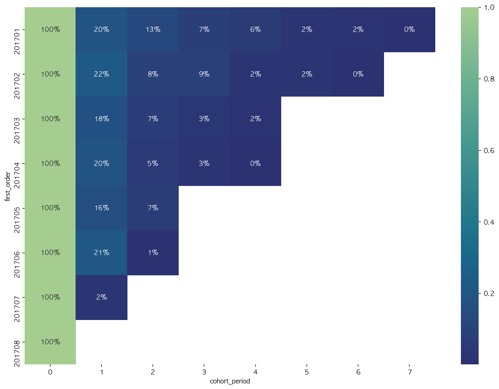

# Google Bigquery 데이터 cohort 분석

## 요약

- 빅쿼리로 코호트 분석에 용이하게 데이터를 집계하였습니다.
- seaborn 라이브러리를 이용하여 코호트 분석 데이터를 시각화하였습니다.
- 시각화 자료로 이상치를 감지하여 인사이트를 발굴하였습니다.




## 빅쿼리로 데이터 집계하여 불러오기

```sql
# 첫 주문일을 계산하기 위한 테이블
with fo as (
	select fullVisitorId as uid, min(left(date,6)) as first_order, 
    from `bigquery-public-data.google_analytics_sample.ga_sessions_*`
    where _table_suffix between '20170101' and '20170831'
    group by fullVisitorId
)
# with문을 사용한 테이블의 첫주문일, '주문일 - 첫주문일'로 계산한 코호트 주기
select d.first_order, 
    cast(d.date as INT64) - cast(d.first_order as int64)  as cohort_period,
    # 중복없는 user수 카운트
    count(distinct d.uid) as user_count
from(
  	# group by로 집계하기 전 테이블을 join
    select ga.fullVisitorId as uid,
  			# ga의 날짜를 'YYYYMM'까지만 사용하여 월별로 집계
        left(ga.date,6) as date,
        left(fo.first_order ,6) as first_order,
    from `bigquery-public-data.google_analytics_sample.ga_sessions_*`  as ga
  			# 첫구매일 테이블 조인
        left join fo on ga.fullVisitorId = fo.uid
  			# '구매완료자'를 필터링 하기위한 조인
        left join unnest(hits) as hits
  	# 구매완료자 필터링
    where hits.eCommerceAction.action_type = '6'
  			# 날짜조건 필터링
        and _table_suffix between '20170101' and '20170831'
) d
# 첫주문일과 코호트주기로 group by
group by d.first_order, cohort_period
order by d.first_order, cohort_period
```


## seaborn으로 시각화


## 인사이트 발굴


- 2월과 6월의 한 달 후 재구매율이 다른 달보다 높은 걸 확인할 수 있습니다.
- 1월의 2달 후 재구매율이 다른 달보다 높은 걸 확인할 수 있습니다.
  - 해당 달의 첫 구매 고객들이 어떤 유저 특성을 가지고 있는지 분석하면, 재구매율이 높은 타겟 특성을 알 수 있습니다.
  - 해당 달의 주 마케팅 유입 채널을 분석하면, 재구매율이 높은 마케팅 채널을 찾을 수 있습니다.
- 위 과정으로 알아낸 세그먼트로 다시 코호트 분석하여 비교하면 더 정확하게 검증이 가능합니다.


